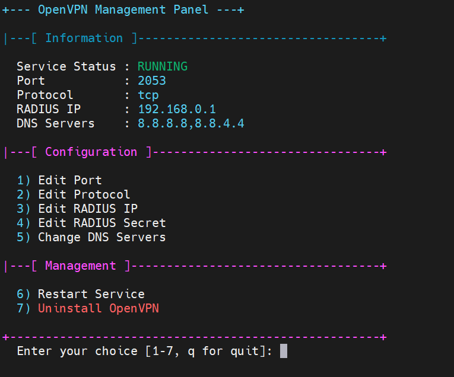

# نصب آسان OpenVPN با احراز هویت RADIUS و پنل تنظیمات

<div dir="rtl">



## 📋 معرفی

این اسکریپت یک نصب‌کننده و پنل مدیریت پیشرفته برای **OpenVPN** است که امکان نصب، پیکربندی و مدیریت آسان سرور OpenVPN را فراهم می‌کند.  بر خلاف بسته‌های استاندارد که از مخازن نصب می‌شوند، این اسکریپت می‌تواند از یک بستهٔ محلی تولید شده توسط اسکریپت سازنده یا آخرین نسخهٔ منتشرشده در GitHub استفاده کند.  همچنین یک پنل مدیریت تعاملی مشابه ocserv برای تنظیمات فراهم شده است.

## 🎯 ویژگی‌ها

- ✅ نصب خودکار و کامل OpenVPN با احراز هویت RADIUS
- ✅ انتخاب منبع نصب (بستهٔ محلی یا دانلود آخرین نسخه از GitHub)
- ✅ تولید و مدیریت کلیدها و گواهی‌های PKI با **Easy‑RSA**
- ✅ سازگاری با IBSng و دیگر سرورهای RADIUS برای مدیریت کاربران و حساب‌ها
- ✅ پنل مدیریت تعاملی برای تغییر پورت، پروتکل (UDP/TCP)، سرور RADIUS و DNS
- ✅ پشتیبانی از چندین سرور DNS (سیستم، گوگل، کلودفلر، OpenDNS)
- ✅ پیکربندی خودکار فایروال و مسیریابی
- ✅ امکان حذف کامل سرویس از طریق پنل
- ✅ قابلیت ساخت پکیج نصبی مستقل از سورس با اسکریپت `openvpn_v2.6.14_builder.sh`

## 🔧 پیش‌نیازها

- سیستم‌عامل Ubuntu 22 یا CentOS 7/8 (متناظر)
- دسترسی root
- حداقل 1GB RAM
- سرور RADIUS فعال و در دسترس

## ⚡ نصب سریع

برای نصب سریع و تعاملی با دانلود اسکریپت از GitHub:

```bash
curl -sSL https://raw.githubusercontent.com/ArashAfkandeh/OpenVPN-Installer/main/install_openvpn.sh | sudo bash
```

## 📝 پارامترهای نصب

این اسکریپت می‌تواند پارامترهای زیر را به صورت خطی دریافت کند تا در حالت غیرتعاملی اجرا شود.  ترتیب آن‌ها مشابه ocserv است:

```bash
curl -sSL https://raw.githubusercontent.com/ArashAfkandeh/OpenVPN-Installer/main/install_openvpn.sh | sudo bash -s -- [PUBLIC_IP] [PROTOCOL] [PORT] [RADIUS_IP] [RADIUS_SECRET] [DNS_CHOICE] [CLIENT_NAME]
```

مثال:

```bash
curl -sSL https://raw.githubusercontent.com/ArashAfkandeh/OpenVPN-Installer/main/install_openvpn.sh | sudo bash -s -- '203.0.113.10' '1' '1194' '192.168.1.100' 'mysecret' '2' 'client1'
```

توضیح پارامترها:

- `PUBLIC_IP`: آدرس IP عمومی یا دامنه سرور (در صورت خالی بودن، اسکریپت سعی می‌کند آن را تشخیص دهد)
- `PROTOCOL`: انتخاب پروتکل 1 برای UDP (پیش‌فرض) یا 2 برای TCP
- `PORT`: شماره پورت OpenVPN (پیش‌فرض 1194)
- `RADIUS_IP`: آدرس IP سرور RADIUS
- `RADIUS_SECRET`: کلید مشترک RADIUS
- `DNS_CHOICE`: انتخاب سرور DNS (1: سیستم، 2: کلودفلر، 3: گوگل، 4: OpenDNS)
- `CLIENT_NAME`: نام فایل پیکربندی کلاینت (مثلاً client)

## 🎛️ انتخاب منبع نصب

در شروع نصب، اسکریپت بررسی می‌کند آیا بستهٔ فشردهٔ محلی (`openvpn-*.tar.gz`) در مسیر `/root` موجود است یا خیر.  اگر این فایل یافت شود، به شما گزینه داده می‌شود که از آن استفاده کنید یا آخرین نسخه را از GitHub دانلود نمایید.  در صورت عدم وجود فایل محلی، آخرین نسخهٔ موجود در مخزن مشخص‌شده به صورت خودکار دانلود و نصب می‌شود.

## 🛠️ اسکریپت سازنده پکیج

برای ساخت پکیج نصب OpenVPN از سورس می‌توانید از اسکریپت زیر استفاده کنید:

- **نام اسکریپت:** `openvpn_v2.6.14_builder.sh`
- **هدف:** کامپایل آخرین نسخهٔ پایدار OpenVPN و بسته‌بندی تمامی فایل‌های باینری، کتابخانه‌ها و یونیت‌های systemd در یک آرشیو قابل استخراج.
- **نحوه استفاده:** این اسکریپت را روی سرور توسعه اجرا کنید تا فایل `openvpn-2.6.14-local.tar.gz` در مسیر `/root` ایجاد شود. سپس می‌توانید این فایل را به سرور مقصد منتقل کرده و در زمان نصب، گزینهٔ «استفاده از بستهٔ محلی» را انتخاب کنید.

## 🎮 امکانات پنل مدیریت

بعد از نصب، با اجرای دستور زیر می‌توانید به پنل مدیریتی دسترسی پیدا کنید:

```bash
ov-p
```

در پنل می‌توانید کارهای زیر را انجام دهید:

1. 🔄 تغییر پورت سرویس
2. 🔄 تغییر پروتکل UDP/TCP
3. 🔑 تغییر IP سرور RADIUS
4. 🔒 تغییر کلید مشترک RADIUS
5. 📡 تغییر سرورهای DNS
6. 🔁 راه‌اندازی مجدد سرویس
7. ❌ حذف کامل OpenVPN

## ❓ سوالات متداول

**س: چرا از RADIUS استفاده شده است؟**
  
ج: RADIUS امکان مدیریت متمرکز کاربران و احراز هویت قوی را فراهم می‌کند و به راحتی با سیستم‌هایی مانند IBSng ادغام می‌شود.

**س: آیا می‌توانم از بستهٔ محلی استفاده کنم؟**
  
ج: بله، اگر پیش از نصب فایل `openvpn-*.tar.gz` را با اسکریپت سازنده ایجاد کرده‌اید و در مسیر `/root` قرار داده‌اید، اسکریپت آن را تشخیص می‌دهد و می‌توانید از آن استفاده کنید.

**س: آیا سرویس SSL نیاز است؟**
  
ج: OpenVPN از گواهی‌های خود امضا یا صادر شده توسط CA داخلی (Easy‑RSA) استفاده می‌کند؛ بنابراین نیاز به Let’s Encrypt ندارد.  با این حال می‌توانید گواهی‌ها را با PKI خارجی جایگزین کنید.

**س: چگونه می‌توانم پکیج ایجاد شده را حذف کنم؟**
  
ج: در پنل مدیریتی گزینه‌ای برای حذف کامل OpenVPN وجود دارد.  همچنین می‌توانید اسکریپت را با پارامتر `uninstall` اجرا کنید: `sudo bash install_openvpn.sh uninstall`.

</div>
